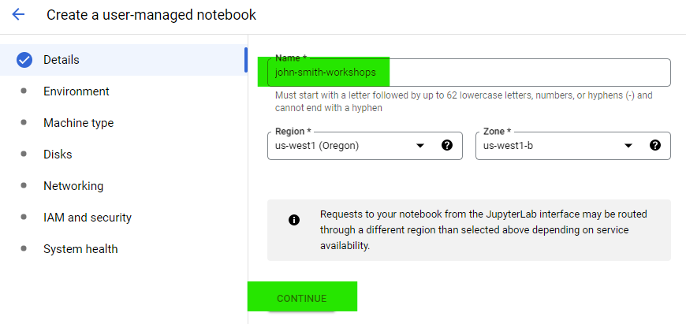

# Session 1

## Data Pipelines CLI: Setting up environment and exploring dataset

Welcome to the **GetInData Modern Data Platform** workshop - `session #1`. In this introductory tutorial you will:
- create your VertexAI notebook - the personal workspace for data transformation project.
- deploy your dbt project with [data-pipelines-cli](https://data-pipelines-cli.readthedocs.io/en/latest/index.html) tool in `Vertex AI` environment
- create your working repository in Gitlab
- navigate through Bigquery console and familiarize with data used during the workshop

For today's exercises the target environment will be Google Cloud Platform's: `BigQuery`, `Vertex AI Managed Notebook` and `VSCode` as IDE.

This tutorial uses our DataOps JupyterLab image gcp-1.5.0.
For more versions and images check out [our public repo](https://github.com/getindata/jupyter-images/tree/master/jupyterlab-dataops).

**Note**: if you're new to data-pipelines-cli and want to know more about the library, check the [documentation](https://data-pipelines-cli.readthedocs.io/en/latest/index.html).

# Exercise

## Before you start

To proceed with this tutorial, you will need a Google account. If you do not have one or are unwilling to use your personal or corporate Gmail address, please create a new Google account dedicated to this workshop (e.g., name.surname.bdtw.mdp.workshop@gmail.com) and send its name to the workshop leaders. Afterward, you will receive an invitation to the Gitlab group and workshop Slack channel where we will share additional information, links, or quick fixes related to the workshop.

## 1. Setup your working environment

In Modern Data Platform by GID, the `VertexAI` user-managed workbook is a main workspace for an analytics engineer. `Vertex AI notebook` is a web-based platform primarily designed for creating, editing, and running machine learning models on Google Cloud Platform. However, the scalable environment of Vertex AI notebook has also proved useful for developing computationally lightweight data transformation projects. It runs on top of a virtual machine instance on Google Cloud Platform. When you create a notebook instance, Google Cloud Platform provisions a virtual machine for you and installs all the necessary software and dependencies. You can then access the notebook instance using a web browser and start coding without having to worry about the underlying infrastructure.

1. Go to `Vertex AI`: [here](https://console.cloud.google.com/vertex-ai/workbench/list/instances?referrer=search&project=bdtw-mdp-workshop&supportedpurview=project).

3. Click on `New Notebook` located in the top bar and then `Customize...`

   

3. Type in notebook name (preferably your first and last name, example: `john-smith-workshops`) and press continue.

    
   
5. In environment section, choose `Debian 10`, then `Custom container`... 

    

    ...and provide a link to the Data Pipelines CLI image: 
    ```
    gcr.io/getindata-images-public/jupyterlab-dataops@sha256:12e217ab88f823308214203628bfe72b0ad233aace3c982efdac023184eb2f79
    ```

    

6. In machine configuration section, choose `n1-standard-1 machine 1vCPU/3.75GB RAM (~0.044 USD / hour)`

    

7. Leave everything else on default.
8. Click on `Create`
9. Wait until it spins up correctly and click on `Open JupyterLab`

    

10. You can start exploring your personal workspace. 
    Note: CloudBeaver (web browser version of Dbeaver, database manager and browser tool) has been pre-installed, however, at this point it is not supported within the notebooks due to authorisation restrictions. 

## 2. Create your repository for your dbt project in Gitlab

GitLab is a web-based Git repository manager that provides a complete DevOps platform for source code management, continuous integration, deployment, monitoring, and more. In MDP we use it as our primary version control system and CICD orchestrator for every dbt project. In this short tutorial you will go through creating a base repository for your data transformations code. Your repo will be stored in a pre-configured group. This group has got several pre-defined variables and keys needed for CICD to synchronize the dbt project with other tools used as a part of MDP, ie. Apache Airflow, Datahub etc.

1. Go to the Workshop Gitlab group page by copy-pasting the following link:

    ```
    https://gitlab.com/bdtw-mdp-workshop
    ```

2. In the main page click on `New project` and then create a new gitlab project using `Create blank project` field.

3. Provide your project's name. We recommend to use your `name-surname-project` naming convention, as in the following example:

    

4. Your new repository is ready. 

## 3. Initialize and explore the dbt project

Our data transformation projects are carried using `dbt`. Every personal notebook created using Jupyter Images provided by the MDP administration has its own `dbt` instance installed, along with `DP Framework` libraries and couple of other popular code editing software (like `VSCode`, `CloudBeaver` etc.). Because we run `dbt` as a part of larger framework, the project creation and initialization is controlled by `DP Command Line Interface` (reminder: `DP Framework` coordinates data transformation, data ingestion, CICD, pipeline orchestration and data catalog sync). 

Normally, in order to kick-off and initialize your data transformation project, you would have to run the `dp create`, the CLI script would then ask you a series of question regarding your project, dwh, schedule interval, ingestion sync etc. As an analytics engineer who went through the onboarding process you would be able to set-up the project without an effort. However, for this workshop we prepared a `quickstart.py` script that creates and initializes the dbt project for you.

1. Navigate to your [Vertex AI notebook](https://console.cloud.google.com/vertex-ai/workbench/user-managed?authuser=0&project=bdtw-mdp-workshop), click on terminal:

    

2. Upload the `quickstart.py` file to the root folder. Note: The file will be shared on Slack channel by the workshop leaders. 

3. Type the following line:

    ```
    python quickstart.py gitlab_username gitlab_email gitlab_repository_name
    ```

     

    The script will setup your personal gitlab profile, clone your repository and initialize your dbt project.

    a) Git will ask for your `https://gitlab.com` credentials: `Username` and Gitlab `password`. Your Username can be found on top-right corner of the Gitlab page (under the icon of your profile):

      

    b) If you're logging to `Gitlab` with your `Google Account`, and you haven't created Gitlab password (or simply don't remember it), you can do it (or reset it) in the profile editor. For that, click on your `User Profile` icon (top-right corner of the Gitlab page) and go to `Edit profile` page. On `User Settings` menu on the left side of the screen, choose `Password`, click on `Save password` / `I forgot my password` and proceed with the further instructions.

      

4. Click `+` icon on top-left side of your notebook screen and enter `VSCode`. You are now ready to explore your freshly created (and yet empty) dbt project.

## 4. Access Bigquery Project

BigQuery is a fully-managed cloud data warehouse service that enables users to store, analyze, and query large datasets using SQL-like syntax. It is part of the Google Cloud Platform and can handle petabyte-scale datasets with high performance and low latency. BigQuery is designed to be scalable, fast, and easy to use, and it supports a variety of data formats and integrations with other GCP services. It allows users to run complex analytical queries on large datasets using a familiar SQL interface, without having to worry about the underlying infrastructure.

The MDP instance we are working with during this tutorial uses `Bigquery`. In order to familiarize yourself with the DWH, proceed with the following steps:

1. Click on the following [link](https://console.cloud.google.com/bigquery?authuser=0&project=bdtw-mdp-workshop&ws=!1m0)

2. The link will open [Google Bigquery SQL Workspace](https://cloud.google.com/bigquery/docs/introduction) for the `bdtw-mdp-workshop` project. In short - Bigquery is the enterprise data warehouse service hosted by Google. Simply speaking you can treat `project` as an equivalent for a Database. All tables, views and schemas are stored there.

3. In BQ `tables` and `views` are stored in `schemas`. You can access them through left side navigation panel. Click on the `raw_data` schema to explore data we're going to use on this workshop. This data is a direct copy of The [Look Ecommerce data set](https://console.cloud.google.com/bigquery(cameo:product/bigquery-public-data/thelook-ecommerce)?authuser=0&project=bdtw-mdp-workshop) created by Google. 

    

4. To create a query, click on the `+` icon on top of the `Editor` tab in the SQL workspace and write the select statement. You can use the sample querries provided by the Looker team, as stated in the Dataset's public description:

    - Total number of sales broken down by product in descending order.

    

    Copy-paste the following query into the SQL Editor and press `Run`. Please note that in Bigquery you reference a table from a specific project using backquote marks:

    ```
    SELECT oi.product_id as product_id, p.name as product_name, p.category as product_category, count(*) as num_of_orders
    FROM `bdtw-mdp-workshop.raw_data.products` as p 
    JOIN `bdtw-mdp-workshop.raw_data.order_items` as oi
    ON p.id = oi.product_id
    GROUP BY 1,2,3
    ORDER BY num_of_orders DESC
    ```

    Using backquote marks is not obligatory. When you are referencing tables stored in your main project, like in the example provided below, you can use a regular notation:
    
    - The store’s top 10 customers with the highest average price per order.

    ```
    SELECT 
    u.id as user_id, 
    u.first_name, 
    u.last_name, 
    avg(oi.sale_price) as avg_sale_price
    FROM raw_data.users as u 
    JOIN raw_data.order_items as oi
    ON u.id = oi.user_id
    GROUP BY 1,2,3
    ORDER BY avg_sale_price DESC
    LIMIT 10
    ```

5. Spend couple of minutes on exploring the dataset! 

It is a dataset which resembles a typical e-commerce shop data warehouse, with events, orders, inventory_items and users facts tables and 2 dimension tables: distribution_centers and order_items. Those tables could've been extracted from different companies' backend applications' databases and collected to a single schema.

For example:
    
 - find out whether there is a difference between `sale_price`, `retail_price` and `cost`?
 - did all users who created website events made a purchase?
 - are there any `null` values regarding `sale_price`, `retail_price` or `cost`?
 - print the list of countries the users shop from. Is there anything that cought your attention regarding their names? (hint: this is actually an important question, since in next Session we will use country names for calculating taxes) 
