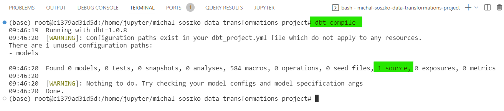
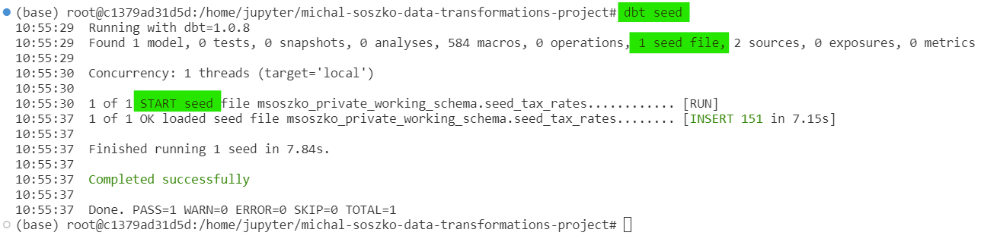
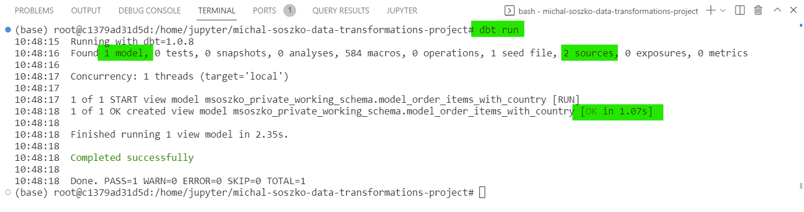
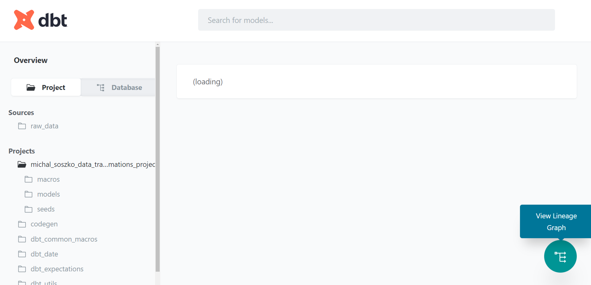

# Session 2a

## GetInData Modern Data Platform: Create simple data pipeline in dbt

Welcome to the **GetInData Modern Data Platform** workshop hands-on `session 2a`. 

By the end of this tutorial, you will learn how to:
- define `sources` in `dbt`
- load static seed data to the data warehouse with the use of `dbt seed`
- create a simple transformation and execute it using `dbt run`

Target environment will be: `BigQuery & Looker Studio` (GCP), `JupyterLab workspace` with `VSCode` as IDE (on-premise). 

This tutorial uses our DataOps JupyterLab image gcp-1.5.0..
For more versions and images check out [our public repo](https://github.com/getindata/jupyter-images/tree/master/jupyterlab-dataops).


# Tutorials


## Introduction

The following exercises will get you through the basic concepts of dbt. For that, we will use our ecommerce dataset and treat it as freshly Extracted and Loaded (EL) raw data and perform several data transformations (T) leading to calculation of VAT for sales report. 

## Defining sources in `dbt`.

Sales data can be found in `raw_data.order_items` table. You can preview schema and data itself by inspecting the [`order_items`](https://console.cloud.google.com/bigquery?authuser=0&project=ext-prj-getindev&ws=!1m5!1m4!4m3!1sext-prj-getindev!2sraw_data!3sorder_items) column in BigQuery. As tax rate can differ depending on place the purchase was made we need to extract information about users` country. This can be found in the [users](https://console.cloud.google.com/bigquery?authuser=0&project=ext-prj-getindev&ws=!1m5!1m4!4m3!1sext-prj-getindev!2sraw_data!3susers) table.

The main rule for `dbt` is that we should avoid writing SQL code referencing datasets and tables stored in `dwh` directly. Instead we should use proper referencing functions `dbt` comes with. So, in order to introduce raw data in our `dbt` project we should define it in form of `yaml` file. To create sources definition follow the instructions:

1. Open your JupyterLab workspace and launch VSCode.

2. Navigate to your project folder and locate `models` folder.

3. Right-click on the `models` folder and create new file. Call it: `source_order_items.yml`

4. Inside of the `source_order_items.yml` paste the following code:

    ```
    version: 2

    sources:
    - name: raw_data
      tables:
      - name: order_items
    ```

    Here, you defined source `name`, which normaly is the same as the `schema` name in your data warehouse (in our example - `raw_data`). Under the `table / name` field you described name of the raw table, which in this case is `order_items`.

    Find more information about dbt sources in dbt documentation: https://docs.getdbt.com/docs/build/sources
**Hint**: defining sources does not have to be a manual chore - check-out a popular [dbt-codegen](https://hub.getdbt.com/dbt-labs/codegen/latest/) extension that supports [automation of this process](https://github.com/dbt-labs/dbt-codegen/tree/0.10.0/#generate_source-source).

5. In order to check whether your source has been defined correctly (note that yaml files are whitespace-sensitive):

    5a. open your terminal (`CTRL+SHIFT+~`)
    
    5b. inside your project folder type:

    ```
    dbt compile
    ```
    
    Dbt will compile the project and return summary report as follows:

    

    If there is `1 source` detected, you have succesfully defined our 1st data source.

6. Now, try to define the second source on your own:

    6a. In `models` folder create a yaml file called `source_users.yml`

    6b. Fill the file with information regarding schema name (`raw_data`) and table name (`users`)

    6c. Compile the project using the `dbt compile` command and inspect the results.

    If there were no mistakes, the summary compilation report should provide information about `2 sources` detected by `dbt`.

<details>
<summary>Solution:</summary>
<pre>
version: 2<br>
sources:
  - name: raw_data
    tables:
    - name: users
</pre>
</details>


## Load a seed CSV file to your data warehouse

In order to calculate VAT, we need information on the applicable VAT rates in the countries where purchases were made. We do not have such data in our raw tables. What we have is a CSV file - [seed_tax_rates.csv](CSV/seed_tax_rates.csv). Insteat of loading it manualy to BigQuery, we will put it into our dbt project as a `seed` file:

1. Upload the [seed_tax_rates.csv](CSV/seed_tax_rates.csv) to `seeds` folder in your dbt project.

    >Hint: You can drag & drop it from your local drive to VSCode Explorer

2. In terminal type the command:
    ```
    dbt seed
    ```
    and inspect the resulting report. You should be able to see a similar output:

    
    
    This is the first resource that has been created with dbt. Table `seed_tax_rates` can now be viewed inside of your personal working schema. 
    
3. In BigQuery inspect your freshly created table within your `private_working_schema` by examining the schema and viewing data.

    ```
    select *
    from <your_personal_working_schema>.seed_tax_rates
    ```

## Create models using `{{ source }}` function

In `dbt`, model is a SELECT statement, no `CREATE TABLE`, `INSERT INTO`, `CREATE OR REPLACE TABLE AS` etc. commands are allowed. By using proper reference functions (`{{ source }}` and `{{ ref }}`) we let dbt to decide upon the execution order while creating entities in the data warehouse. 

In our example, for calculating VAT we need to join `order_items` with `users` to add information about `country` to our sales log. For that we will create new dbt model and execute the whole project locally.

1. In `models` folder inside of your project folder create new file called `model_order_items_with_country.sql`.

2. Inside of the newly created file type the following SQL code, **filling in the missing lines**:

    ```
    with order_items as (
        select * from {{ source('raw_data', 'order_items') }}
    ),
    users as (
    -- fill the corresponding CTE with a proper select statement 
    -- using the {{ source }} function directing the raw_data.users table:


    )

    select
        oi.id               as order_item_id,
        oi.order_id         as order_id,
        oi.user_id          as user_id,
        oi.product_id       as product_id,
        oi.status           as order_status,
        oi.sale_price       as order_item_sale_price,
        u.country           as user_country
    from
        order_items as oi
    left join
        users as u on oi.user_id = u.id
    ```
    
    Please note, that in this SELECT statement we used `{{ source }}` function as we refer directly to the previously defined sources in `source_order_items.yml` and `source_users.yml` files. We do not put direct reference to `raw_data.users` 

3. In terminal type the command:

    ```
    dbt run
    ```
    You should be able to see an output like the one below:

    

    Here dbt informs you it executed 1 model called `model_order_items_with_country` and materialized it as a `view` in your private working schema. Do not worry about materialization now. We did not specify what kind of entity we want from `dbt` to create while executing our models and `dbt` choosed the default one - the view. We will cover this topic in further exercises. 

    Note that sources have not been materialized like our model was. That's because they are not `dbt` entities, but a raw data already existing in our dwh.

<details>
<summary>Solution:</summary>
<pre>
with order_items as (
    select * from {{ source('raw_data', 'order_items') }}
),
users as (
-- fill the corresponding CTE with a proper select statement 
-- using the {{ source }} function directing the raw_data.users table:
    select id, country from {{ source('raw_data', 'users') }}
)

select
    oi.id               as order_item_id,
    oi.order_id         as order_id,
    oi.user_id          as user_id,
    oi.product_id       as product_id,
    oi.status           as order_status,
    oi.sale_price       as order_item_sale_price,
    u.country           as user_country
from
    order_items as oi
left join
    users as u on oi.user_id = u.id
</pre>
</details>

4. In BigQuery inspect your freshly created table within your `private_working_schema` by examining the schema and viewing data

    ```
    select *
    from <your_personal_working_schema>.model_order_items_with_country
    ```

    > Hint: you could inspect table in search for null values. Data has not been cleaned (we are using raw tables) so you could expect some troubles... We will cover data quality checks in further session.

## Create models using `{{ ref }}` function

Having created our first model, we can now add tax rates to our `model_order_items_with_country` table and calculate VAT for each sales. Because this table has been created as a result of model execution (`dbt run`), we will use jinja function `{{ ref }}`. The same is for previously loaded `seed` file (the difference is we created this resource with `dbt seed` command). This will allow dbt to calculate table lineage for the pipeline we build correctly. 

1. In `models` folder inside your project folder create new file called `model_order_items_with_tax.sql`.

2. Inside of the newly created file type the following SQL code, **filling in the missing lines**:

    ```
    with _order_items_with_country as (
        select * from {{ ref( 'model_order_items_with_country' ) }}
    ),
    tax_rates as (
    -- fill the corresponding CTE with a proper select statement 
    -- using the {{ ref }} function directing the seed_tax_rates entity:


    )

    select
        order_item_id,
        order_id,
        user_id,
        product_id,
        order_status,
        order_item_sale_price,
        user_country,
        tr.Tax_Rate     as tax_rate,

        round(order_item_sale_price * (tr.Tax_Rate / (100 + tr.Tax_Rate)), 2)      as order_items_sale_VAT

    from
        _order_items_with_country as oi
    left join
        tax_rates as tr on oi.user_country = trim(tr.Country)
    ```

3. In terminal type the command:

    ```
    dbt run
    ```

    Now, in the output dbt should execute 2 models. First, `order_items_with_country` and then `order_items_with_tax`. Note that `seed_tax_rates` CSV has not been executed as seed files are loaded into dwh with different command (`dbt seed`). 

4. In BigQuery inspect your freshly created table within your `private_working_schema` by examining the schema and viewing data.

    ```
    select *
    from <your_personal_working_schema>.model_order_items_with_tax
    ```

    > Hint: There may be some data quality issues in `order_items_with_country`. If they exist, they will be passed further in downstream models.

<details>
<summary>Solution:</summary>
<pre>
with _order_items_with_country as (
    select * from {{ ref( 'model_order_items_with_country' ) }}
),
tax_rates as (
-- fill the corresponding CTE with a proper select statement 
-- using the {{ ref }} function directing the seed_tax_rates entity:
    select Country, Tax_rate from {{ ref('seed_tax_rates') }}
)

select
    order_item_id,
    order_id,
    user_id,
    product_id,
    order_status,
    order_item_sale_price,
    user_country,
    tr.Tax_Rate     as tax_rate,
    round(order_item_sale_price * (tr.Tax_Rate / (100 + tr.Tax_Rate)), 2)      as order_items_sale_VAT

from
    _order_items_with_country as oi
left join
    tax_rates as tr on oi.user_country = trim(tr.Country)
</pre>
</details>

### Congrats!

You have created a simple end-to-end data pipeline using dbt. The data may have some issues though, but we will cover this part later. At this point you can preview graphical lineage of your dbt project by typing in the terminal:

```
dp docs-serve
```

This will open internal dbt documentation page (note that you will be asked to grant permission for a pop-up window once the page is ready). Feel free to navigate and inspect every resource stored there. You will find graphical lineage icon on the right-bottom of the screen.


