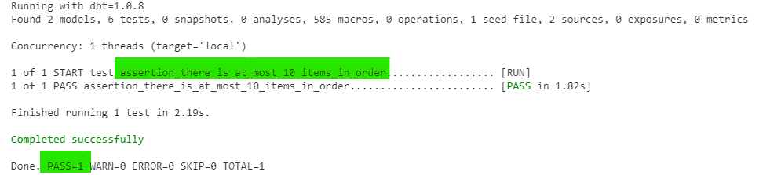
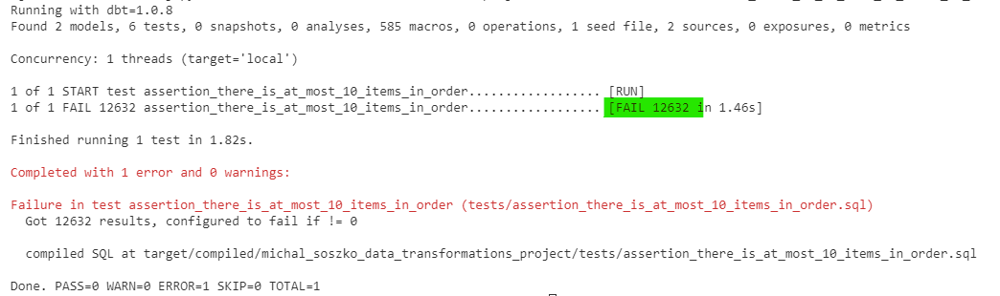

# Session 2b

## GetInData Modern Data Platform: Test and document models

Welcome to the **GetInData Modern Data Platform** workshop hands-on `session 2b`. 

By the end of this tutorial, you will learn how to:
- apply built-in `generic test` to your dbt resources
- create and apply your custom singular tests
- create and apply your custom generic tests
- add column and table level descriptions to your dbt resources

Target environment will be: `BigQuery & Looker Studio` (GCP), `JupyterLab workspace` with `VSCode` as IDE (GKE).


# Tutorials

## Introduction

In dbt test is a select statement representing assertion about your models. Tests are constructed in a way that they fail whenever SQL statement returns any record. So, for example, if we test a column for a presence of `null` values, we will write a query that returns rows where the `null` value is present. If the output of the query is empty - no records were found, the test will pass, and thus we know there are no nulls in our column. In the case where the query returns records (rows, where tested column is nullified) - test fails.
You can put a test on every dbt resource: sources, seeds, models and snapshots.

## Create and apply custom singular test

For better understanding we will first create a custom singular test and apply it to one of our models. Lets assume, that by decission of our ecommerce company, any order having more than 10 products is prevented from beeing taken. We can then make a test that checks whether there are orders breaking this rule:

1. In your project folder navigate to `tests` directory and create `assertion_there_is_at_most_10_items_in_order.sql` file.

2. Fill the empty file with the following sql statement:

    ```
    with tested_order_items as (
        select * from {{ ref('model_order_items_with_country') }}
    ), 
    precalc as (
        select 
            order_id,
            count(order_item_id) as cnt
        from tested_order_items
        group by 1
    )
    select
        *
    from precalc
    where cnt > 10
    ```

3. In terminal type the command:

    ```
    dbt test
    ```
    and inspect the resulting report. You should be able to see a similar output:

    

    The test passes as there are no orders having more than 10 items in a bucket.

    In case there are more singular tests but you need to run a selected one, you can specify it using `--select` clause:

    ```
    dbt test --select assertion_there_is_at_most_10_items_in_order
    ```

4. Now, in order to verify if our test SELECT statement is working correctly we can change test conditions and force it to fail on purpose. For that modify the `where cnt > 10` condition and rerun the test.

    If you reduce the `cnt` value to `2` the test output should be as follows:

    

    So this time our test checks whether there are orders storing more than two products. And ineed there are such orders present, so the test fails.

5. The task: Think of your own custom-made singular test, create the SQL file and verify if it works correctly in a way presented in the example above. Note that you can apply tests for models as well as for seeds or sources, just remember to use proper referencing functions!

    > Example 1: An example of such assertion could be that there should be no refunds present in the sales log (sale price is always > 0)
   
    <details>
    <summary>Solution:</summary>
    <pre>

    -- tests/assertion_there_are_no_refunds_in_sales_log.sql

    select order_item_id
    from {{ ref('model_order_items_with_tax') }}
    where order_item_sale_price < 0

    </pre>
    </details>


    > Example 2: Write a custom test that checks whether there are country names with additional whitespaces in our `seed_tax_rate` table.


      <details>
      <summary>Solution:</summary>
      <pre>
      -- tests/assertion_there_are_no_extra_spaces_in_countries_names_in_tax_rates.sql

      select * 
      from {{ ref('seed_tax_rates') }}
      where country <> trim(country)
      </pre>
      </details>

## Apply built-in `generic test` to your dbt resources

Singular tests are good way to put your data into validation. However, their limitation is, that they can be used only for specific cases (eg. for specific models they reference to) as they are 'hardcoded'. As an alternative, dbt allows to create generic test as a macro using jinja functions. Moreover, dbt comes with couple of built-in generic tests. These are: `not_null`, `unique`, `accepted_values` and `relationships`. Generic tests are applied to a `model` (but also `seed` or `source`) by adding corresponding lines in `yaml` metaconfig. 

Let's put some tests to `model_order_items_with_tax`.

1. In `models` folder create YAML file called `model_order_items_with_tax.yml`.

2. Inside of freshly created file add the following lines:

    ```
    version: 2


    models:
    - name: model_order_items_with_tax
    
      columns:
      - name: order_item_id
        tests:
          - unique
          - not_null
    ```

    In this YAML file we added metaconfig for `model_order_items_with_tax` by specifying its `name` in `models` section. In `columns` section we added `unique` and `not_null` generic tests that verify whether in `order_item_id` records are unique and not empty. 

3. In order to run tests on your model type the following command in the temrinal:

    ```
    dbt test
    ```

    You will notice this command runs all tests defined in your project. However, sometimes it is reasonable to narrow the execution for a specific model only. For that you can type the `run` command with proper `--select` clause:

    ```
    dbt test --select model_order_items_with_tax
    ```

    Note: In order to run all test on models upstream or downstream your tested model you can add `+` in front or on the back of the models name:

    ```
    dbt test --select +model_order_items_with_tax // runs all tests for the model_order_items_with_tax + all upstream models

    dbt test --select model_order_items_with_tax+ // runs all tests for the model_order_items_with_tax + all downstream models
    ```

### Exercise
1. Check the docs for generic `accepted_values` test in https://docs.getdbt.com/docs/build/tests#generic-tests and apply it on `order_status` column. Values stored in this columns should be `Shipped`, `Complete`, `Cancelled`, `Processing` and `Returned` only, nulls are not allowed.

    <details>
    <summary>Solution:</summary>
    <pre>
    version: 2<br><br>
    models:
    - name: model_order_items_with_tax<br>
      columns:
      - name: order_item_id
        tests:
          - unique
          - not_null
      - name: order_status
        tests:
          - accepted_values:
              values: ['Shipped', 'Complete', 'Cancelled', 'Processing', 'Returned']

    </pre>
    </details>

2. Experiment and add couple more built-in generic tests to other resources in your project. If you decide to test seeds, check the documentation (https://docs.getdbt.com/reference/seed-properties) to learn more about about seeds YAML properties.

    <details>
    <summary>Example solution (testing seeds):</summary>
    <pre>
    -- models/schema.yml <br>
    version: 2 <br><br>
    seeds:
    - name: seed_tax_rates<br>
      columns:
        - name: Country
          tests:
            - not_null
            - unique

    </pre>
    </details>

## Create and apply your custom generic test

Like it was mentioned earlier, dbt allows to create generic test as a macro using jinja functions. This is particulary useful while you want to apply a test with custom logic for broader set of tables and columns. In this section we will create a simple generic test and apply it on our selected model. 

The generic test will inspect numerical values stored in choosen `table.column` and verify if they are positive.

1. In `macros` folder add a directory called `generic_tests` and create empty file called `is_positive_value.sql`.

2. In freshly created file pass the following lines of code:

    ```
    

    with validation as (
        select
            {{ column_name }} as tested_value
        from {{ model }}
    ),
    validation_errors as (
        select
            tested_value
        from validation
        where tested_value < 0
    )

    select *
    from validation_errors

    
    ```

    The code above defines a macro of type `test` called `is_positive_value`. This macro uses two variables called `model` and `column_name`. These are important variable names and should not be changed as they allow this test to be applied within dbt model YAML metaconfig. Notice, in dbt, we call variables within the SQL code referencing them with double `{{ }}` notation. 

3. In `models` folder edit YAML file called `model_order_items_with_tax.yml` and add new lines of code:

    ```
    version: 2


    models:
    - name: model_order_items_with_tax
    
      columns:
      - name: order_item_id
        tests:
          - unique
          - not_null

    # add custom generic test:
      - name: order_item_sale_price
        tests:
          - is_positive_value
    ```

    The following lines will add `is_positive_value` custom generic test defined in `macros/generic_tests` folder to `order_items_sale_price` column. The result of the test will tell us, whether all values stored as sale_price are positive (there is only an income) or there are some negative numbers indicating ie. refunds.

4. Run tests with the following command and inspect the output.

    ```
    dbt test --select model_order_items_with_tax
    ```

You can read more about Jinja macros and custom generic tests in dbt in the documentation page https://docs.getdbt.com/docs/build/jinja-macros


## Add column and table level description to dbt models

Adding descriptions to your tables and columns on early stage of data transformation project helps with building project documentation in future. In this short section you will add docs to the `model_order_items_with_tax` using different description modes.

1. In `models` folder edit YAML file called `model_order_items_with_tax.yml` and add new lines of code:

    ```
    version: 2


    models:
    - name: model_order_items_with_tax
      description: "
      ## Order items with calculated VAT
      
      This is the `order_items` model enhanced with 
        
        - country column taken from `users` model 
        
        - tax rates values taken from `seed_tax_rates` CSV file"
    
      columns:
        - name: order_item_id
          description: 'Unique id of the ordered item, primary key'
          tests:
          - unique
          - not_null
    
        - name: order_item_sale_price
          description: "Item's sale price"
          tests:
          - is_positive_value

        - name: order_items_sale_VAT
          description: 'Calculated VAT for item sold within the order'
    ```

2. In order to check whether the documentation has been added correctly compile the project. Run the following command:

    ```
    dbt compile
    ```

    ... and inspect results. If there are no errors, docs has been implemented succesfully.

3. You can now preview your documented models using internal dbt docs generator:

    ```
    dp docs-serve
    ```

    Note: if you previously launched the dp docs-serve command you don't have to do it for the second time. In that you will need to update existing docs by running the following command:

    ```
    dbt docs generate
    ```

### Exercises

1. Try adding your own descriptions to your models.

You can find more information about project documenting within dbt here: https://docs.getdbt.com/docs/collaborate/documentation 

### This concludes the exercises planned for this Section!
