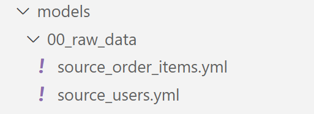
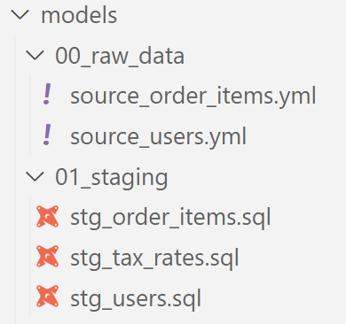
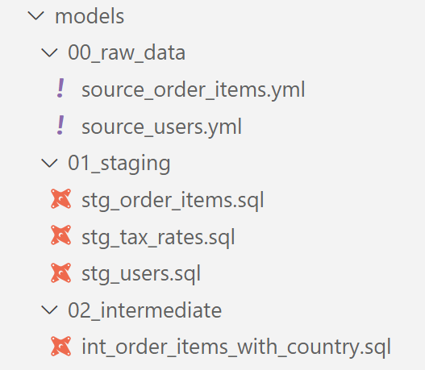
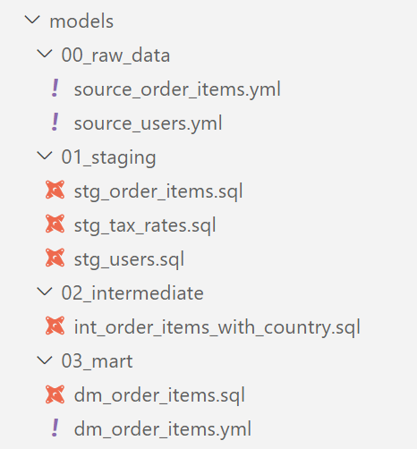
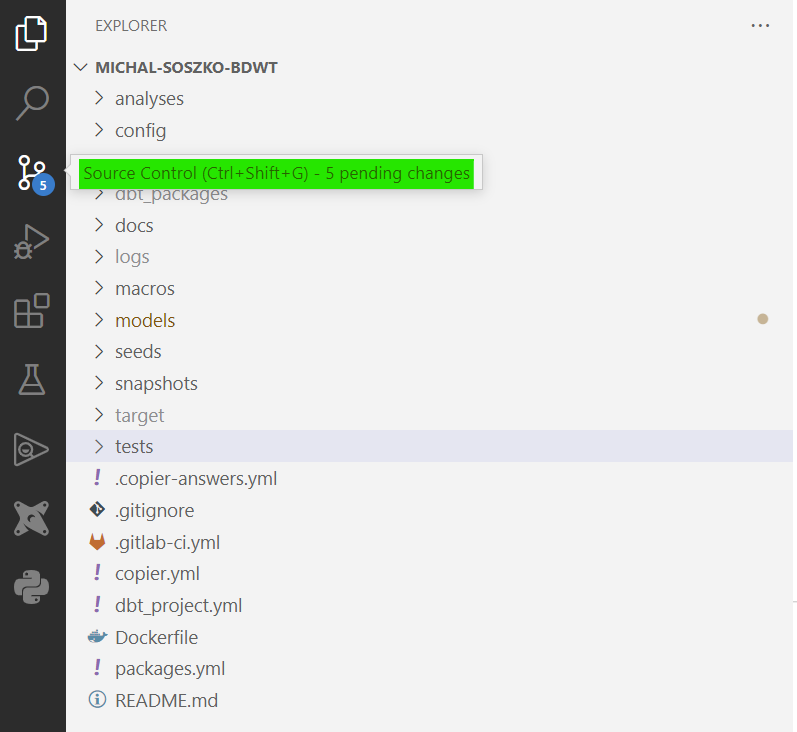
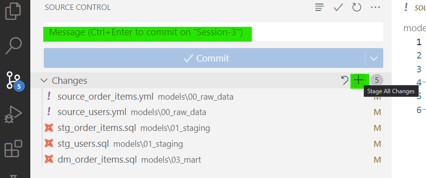
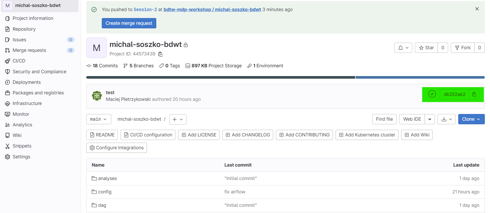
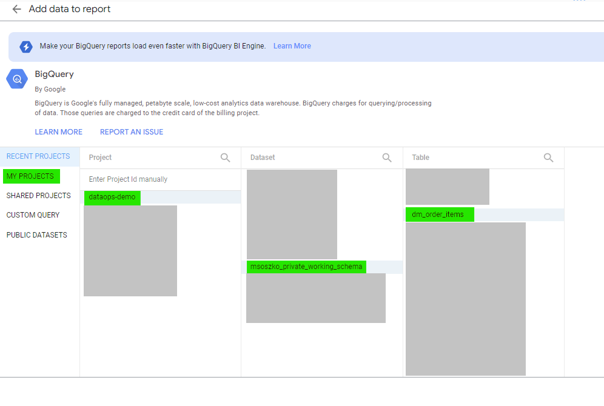
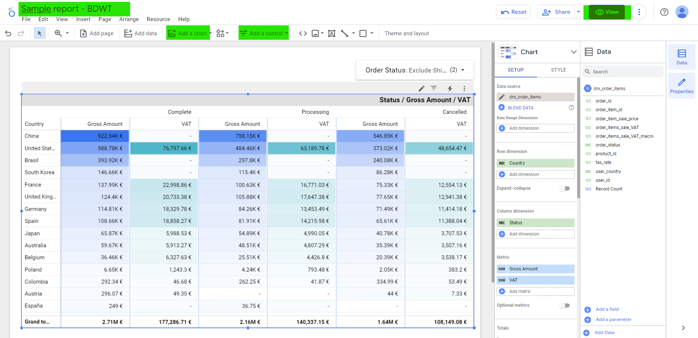

# Session 3

## GetInData Modern Data Platform: Test and document models

Welcome to the **GetInData Modern Data Platform** workshop hands-on `session 3`. 

By the end of this tutorial, you will learn how to:
- improve your dbt pipeline by using modern project structuring conventions
- apply jinja macro in your SQL code
- publish your work to DEV using Git and CICD
- review the pipeline execution results in data catalog and connect data with a BI tool

Target environment will be Google Cloud Platform's: `BigQuery & Data Studio`, `JupyterLab workspace`, `VSCode` as IDE. 

This tutorial uses our DataOps JupyterLab image gcp-1.5.0.
For more versions and images check out [our public repo](https://github.com/getindata/jupyter-images/tree/master/jupyterlab-dataops).


# Tutorials

## Introduction

A proper structuring of a project in dbt is crucial because it allows for efficient and organized development of data models. With a well-defined structure, it becomes easier to manage dependencies between models, track changes, and maintain a consistent approach to development. This helps ensure the accuracy and reliability of the data produced by the models, and facilitates collaboration among team members working on the project. 

In section 3 we will refactor the pipeline we already created and apply modern project structuring approach. Then we will commit our work to remote repository. The repository is stored in GitLab, a web-based repository manager that is part of our modern data stack. GitLab also provides continuous integration and delivery, allowing our code (after some treatment) to be distributed across various components of our modern data stack, such as the scheduler, data catalog, ingestion tool, and BI tool.

In this chapter we will reforge our set of dbt models into a well organized and structured project, dividing it into three logic layers: `staging`, `intermediate` and `mart`. 


## Refactoring the dbt pipeline

### Staging area

A `Staging area` is a transformation layer where data is cleaned (by formating, spliting / concating, json extracting etc.), column naming convention is applied, as well as some basic calculation and conversions are included. In this layer we avoid joining models.

1. In `models` folder inside of your project create subfolder called `00_raw_data`.

2. Move (ie. by using drag and drop) both `source_order_items.yml` and `source_users.yml` into newly created `models/00_raw_data folder`.

    The result should look as follows:

    

3. Perform a code check by running `dbt compile` command in the command line.

4. Create second subfolder in `models` directory, call it `01_staging`.

5. Inside of the `01_staging` folder create new model file called `stg_order_items.sql`.

6. Add the following SQL statement:

    ```
    with source as (
        select * from {{ source('raw_data', 'order_items') }}
    ),
    cleaned as (
        select
            id                      as order_item_id,
            order_id                as order_id,
            user_id                 as user_id,
            product_id              as product_id,
            inventory_item_id       as inventory_item_id,
            status                  as order_status,
            created_at              as order_created_at,
            shipped_at              as order_shipped_at,
            delivered_at            as order_delivered_at,
            returned_at             as order_returned_at,
            sale_price              as order_item_sale_price
        from source
    )
    select * from cleaned
    ```

    Note, this is the staging model, where we are referencing the source (`{{ source (....) }}`) placed in `00_raw_data` folder. For dbt it does not matter where the model is stored - and that is because all model names need to be unique. Inside of SQL we changed column names applying our custom naming convention.

7. Perform a code check by running `dbt compile` command in the command line.

8. **Exercise**: Repeat steps `5` - `7` for new model file called `stg_users`. 
    
    > Hint: You can choose whatever column naming convention you prefer.

    > Hint2: Use Bigquery to check schema for `raw_data.users` table.

<details>
<summary>Preview example of the resulting SQL statement</summary>
<br>
<pre>
with source as (
    select * from {{ source('raw_data', 'users') }}
),
cleaned as (
    select
        id                  user_id,
        first_name          user_first_name,
        last_name           user_last_name,
        email               user_email,
        age                 user_age,
        gender              user_gender,
        state               user_address_state,
        street_address      user_street_address,
        postal_code         user_postal_code,
        city                user_city,
        country             user_country,
        latitude            user_geo_latitude,
        longitude           user_geo_longitude,
        traffic_source      user_acc_traffic_source,
        created_at          user_acc_created_at
    from source
)
select * from cleaned
</pre>
</details>

9. Create the third staging model, this time for our `seed_tax_rates` CSV file. Call it `stg_tax_rates.sql`. Put the following code inside and perform `dbt compile` check:
    
    ```
    with tax_rates as (
        select * from {{ ref( 'seed_tax_rates' ) }}
    ),
    cleaned as (
        select 
            Country         as country,
            Tax_Rate        as tax_rate,

            trim(Country)   as country_cleaned
        from tax_rates
    )
    select * from cleaned
    ```

    Note that in this model, apart lowercasing column names, we added new column called `country_cleaned`. you might have noticed that in `model_order_items_with_tax.sql` the join between `order_items_with_country` column and `tax_rates` is performed on `trim(tax_rates.Country)`. The purpose of staging layer is to avoid such complications for downstream models if possible. This is a simple example but you could imagine a complicated join on a case-when statement in several subqueries making the code a little bit harder to understand.

After performing steps 1-9 your `models/` you should obtain a similar image:




### Intermediate area

An `Intermediate area` is a transformation layer where we apply complex conversions, business logic, calculations, joins etc. Tables (views) we create here are close in shape to what we'd like to use for reporting and analysis. However, the resulting data is intermediate and requires further treatmen. Intermediate models are generaly hidden from data consumers and BI tools. Plus, intermediate models always reference staging / source data.

1. In `models` directory, create a new subfolder, call it `02_intermediate`.

2. Inside of the `02_intermediate` folder create new model file called `int_order_items_with_country.sql`.

3. **Exercise**: Knowing the `int_order_items_with_country` intermediate model is nearly a 1:1 copy of the existing `model_order_items_with_country`, fill up the new model with a proper SELECT statement.

    >Note: New model should be referencing staging models created in previous chapter

<details>
<summary>Preview example of the resulting SQL statement</summary>
<br>
<pre>
with order_items as (
    select * from {{ ref('stg_order_items') }}
),
users as (
    select * from {{ ref('stg_users') }}
)
select
    oi.order_item_id,
    oi.order_id,
    oi.user_id,
    oi.product_id,
    oi.order_status,
    oi.order_item_sale_price,
    u.user_country
from
    order_items as oi
left join
    users as u on oi.user_id = u.user_id
</pre>
</details>

4. Compile the dbt project to check for a presence of errors. At this point it would be reasonable to run the new part of the pipeline as well. For that you can use the following command:

    ```
    dbt run --select +int_order_items_with_country
    ```

5. If the pipeline succeeds you can preview resulting views in Bigquery.

After performing steps 1-5 your project structure should now look similar to the example below:




### Marts area

A `mart layer` is a type of transformation layer that is used to build a data models optimized for querying and analysis. A mart layer typically includes tables that represent the different dimensions and measures of the data model, as well as any derived or calculated fields that are needed for analysis.

1. In `models` directory, create a new subfolder, call it `03_mart`.

2. Inside of the `03_mart` folder create new model file called `dm_order_items.sql` and attach YAML metaconfig - `dm_order_items.yml`.

3. **Exercise** propose a SQL statement and YAML config for newly created (empty) model. Similar to previous chapter's intermediate example, use the fact that `dm_order_items` (along with its metacofnig YAML) is nearly a 1:1 copy of the `model_order_items_with_tax`.

    > Note: dm_order_items should be referencing 1 staging model and 1 intermediate model.

<details>
<summary>Preview an example of SQL statement here</summary>

<pre>
with _int_order_items_with_country as (
    select * from {{ ref( 'int_order_items_with_country' ) }}
),
tax_rates as (
    select * from {{ ref( 'stg_tax_rates' ) }}
)
select
    order_item_id,
    order_id,
    user_id,
    product_id,
    order_status,
    order_item_sale_price,
    user_country,
    tr.tax_rate,
    round(order_item_sale_price * (tr.tax_rate / (100 + tr.tax_rate)), 2) as order_items_sale_VAT
from
    _int_order_items_with_country as oi
left join
    tax_rates as tr on oi.user_country = tr.country_cleaned
</pre>
</details>

<details>
<summary>Preview an example of YAML config here</summary>

<pre>
version: 2
<br>
models:
- name: dm_order_items
  description: "
  ## Order items with calculated VAT 
<br>
  This is the `order_items` model enhanced with  <br>    
  - country column taken from `users` model<br>  
  - tax rates values taken from `seed_tax_rates` CSV file"<br>
  columns:
    - name: order_item_id
      description: 'Unique id of the ordered item, primary key'
      tests:
        - unique
        - not_null<br>
    - name: order_status
      description: Current status of the order
      tests:
        - accepted_values:
            values: ['Shipped', 'Complete', 'Cancelled', 'Processing', 'Returned']<br>
    - name: order_item_sale_price
      description: "Item's sale price"
      tests:
        - is_positive_value<br>
    - name: order_item_sale_vat
      description: 'Calculated VAT for item sold within the order'
</pre>
</details>

4. Compile the dbt project to check for a presence of errors. At this point it would be reasonable to run the new part of the pipeline as well. For that you can use the following command:

    ```
    dbt run --select +dm_order_items
    ```

5. If the pipeline succeeds you can remove all SQL and YAML files from the `models` main folder, leaving only models stored in layer subdirectories. Also, you can preview resulting views in Bigquery. 

After performing steps 1-5 your project structure should now look similar to the example below:



### Setting up materialization type for data transformation layers

The `dbt_project.yml` is a configuration file that specifies project-level settings and options for a dbt project. In our modern data platform setup this file has been pre-configured, but it is up to user whether he wants to modify the config according to his needs. In case of model materialization the user can specify one of the three possible options: `view`, `ephemeral` and `table`.

1. In the root folder of your project, locate and edit `dbt_project.yml` file.

    In the bottom section of the file the global configuration for all models have been specified as follows:

    ```
    models:
      yourusername_project:
        01_staging:
          +materialized: view
          +schema: yourusername_hdp_workshop_01_staging
        02_intermediate:
          +materialized: view
          +schema: yourusername_hdp_workshop_02_intermediate
        03_mart:
          +materialized: table
          +schema: yourusername_hdp_workshop_03_mart
    ```

2. **Exercise**: change materialization to `table` in for all data transformation layers defined in the project.

3. Execute the pipeline locally by running the `dbt run` command.

You can read more about model materializations in https://docs.getdbt.com/docs/build/materializations

## Apply Jinja macro in your SQL code

Jinja macros are reusable pieces of code that are written in Jinja, a templating language used by dbt. They are similar to functions in other programming languages. In this simple example we will create a macro that takes `gross amount`, `tax rate` and return VAT with a given `precision` (set by default as 2) using to the formula:

VAT amount = gross amount * (tax rate / (100 + tax rate))

1. In macros folder create new file called `calculate_VAT.sql`

2. Add the following snippet of code to a newly created SQL file:

    ```
    
        round({{ gross_amount }} * ({{ tax_rate }} / (100 + {{ tax_rate }})), {{ precision }})
    
    ```

3. **Exercise**: In `models/03_mart/dm_order_items.sql` file add the following line to the select statement:

    ```
    {{ calculate_VAT('order_item_sale_price', 'tr.tax_rate') }}   as order_items_sale_VAT_macro
    ```

    You can delete the order_items_sale_VAT column, or leave it for comparison.

<details>
<summary>The resulting model should now look as follows</summary>
<pre>
with _order_items_with_country as (
    select * from {{ ref( 'int_order_items_with_country' ) }}
),
tax_rates as (
    select * from {{ ref( 'stg_tax_rates' ) }}
)<br>
select
    order_item_id,
    order_id,
    user_id,
    product_id,
    order_status,
    order_item_sale_price,
    user_country,
    tr.tax_rate,<br>
    round(order_item_sale_price * (tr.tax_rate / (100 + tr.tax_rate)), 2)      as order_items_sale_VAT,
    {{ calculate_VAT('order_item_sale_price', 'tr.tax_rate') }}   as order_items_sale_VAT_macro<br>
from
    _order_items_with_country as oi
left join
    tax_rates as tr on oi.user_country = tr.country_cleaned
</pre>
</details>

    
Note that whenever we call a marco wthin the SQL code in dbt, we need to put it in a double `{{ }}` brackets and pass the variables in quotes. As this is only a simple example, bear in mind that macros can be very complex and they can be used to build a very flexible SQL code.

## Publish your code to Gitlab and inspect results of CICD 

To transfer results of your local work and publish it into remote repository where you store the code of the project, you need to use version control system. In our Modern Data Platform we use Gitlab. Your project has been created by you during Session 1. Now it is time to commit your work. After pushing your code to remote repository, the CICD pipeline launuches. During CICD phase, the gitlab runner triggers a virtual machine with its own dbt instance. Your code is compiled and checked for errors. After all checks are passed the code (after some transformations) is distributed across other tools that are part of the MDP - data catalog, scheduler, ingestion tool etc. As we directly commited to the main branch, the code may be treated as "production" now. 

> Note: There are many strategies on how to manage `local` / `dev` / `prod` environments on Gitlab. This topic is, however, out of scope for this webinar.

In order to commit your work to remote you can use either command line or VSCode source control tab. We will start with VSCode.

### Commiting to remote repository using VSCode

1. In VSCode, locate and click on the source contril icon.

    

2. Inspect changes in your code by viewing the changed models, then stage all changes, or discard them. 

3. Press the `+` sign and stage all changes, then fill in a message field and press `Commit`

    

4. VSCode is ready to synchronize your local repository and the remote one. In order to do so, click on `Sync Changes`

5. VSCode will may ask for your gitlab user name and password to be able to proceed. In such case, the small window will pop-up. Provide your credentials when that happens.

### Commiting to remote repository using CLI

1. Check the status of your local repository by typing the following command in CL:

    ```
    git status
    ```

2. Stage all changes you made, type:

    ```
    git add -A
    ```

3. Commit changes to your local repository by typing the following command:

    ```
    git commit -m 'Put your message here'
    ```

4. Push your local repository to the remote:

    ```
    git push
    ```

### View your remote repository and the CICD pipeline status

After pushing your local changes to remote repository you will be able to inspect the status of the CICD phase. In order to do so:

1. go to our gitlab group: https://gitlab-frontend.home.net.pl/getindataworkshops/hdp-workshops/ and locate your repository. 

2. In your repository page locate the CICD pipeline status indicator. You can inspect details by clicking on the `succes` or `fail` icon 

    


## Review the pipeline execution results with Data Catalog, Airflow and BI Tool

After commiting our project to remote repository, the code is distributed over all components of the Modern Data Platform. You can preview execution of the production pipeline performed by Airflow, inspect your models and their corresponding metadata in Data Catalog or proceed with analysis using Looker Studio. 

For Airflow and Data Catalog, you will receive corresponding links through the workshops Slack channel. You can freely explore their content.

### Trigger pipeline in Airflow

1. Click on the Apache Airflow link provided in Slack and navigate to your project's pipeline (for simplicity, the DAG's name has been automaticaly set by DP Framework to be the same as your gitlab user name).

2. Examine the DAG by clicking on `Graph View`. 

3. Trigger the pipeline by pressing `Play` button. 

> Note: If any of your tests fails, the pipeline stops. Because of that it is necasary to keep your data quality high! For now, however you can deactivate (delete / change conditions) all failing tests to allow pipelie to finish. If there are data quality issues, you will have a chance to fix them in couple of minutes. 

### Add mart model connection to Looker Studio

For connecting your "prod" tables with the BI tool, follow the instructions provided below:

1. Enter Looker studio navigation panel by clicking on this [link](https://lookerstudio.google.com/u/1/navigation/reporting). Note, you need to be logged in your gmail account to get access to our Bigquery datasets.

2. Add a blank report.

3. Use `Google connectors`: `BigQuery` and add our project 'ext-prj-getindev`.

4. Choose your dataset, `username_03_mart` and pick up the `dm_order_items` table, finish by clicking `Add`.

    

5. Start exploring your data and a create simple report. 

    

## Bonus exercise: Investigate data quality issues

As you might have noticed while inspecting mart tables, there are `null` values present in calculated VAT fields. As there is a measurable possibility that for some countries the concept of VAT has not been implemented, it is definitely not the case for China, Austria or Germany. Investigate the cause of this and fix the data!

>Hint: You could think of creating a custom test that checks integrity between coutries in `order_items` table and a corresponding list taken from `seed_tax_rates` 

>Hint2: Don't forget to push your work to remote and run the production pipeline to update `03_mart` models with your fix!
